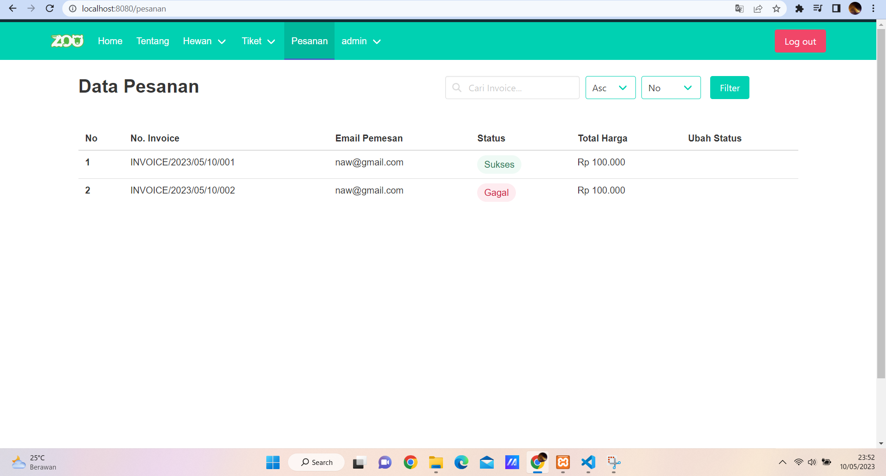

# Projek Akhir Kelompok 6 Kelas A1
Nama Anggota Kelompok :
- 2109116001 Rizky Maulana Alfauzan
- 2109116003 Dzakiroh Nawaal Nabilah
- 2109116022 Rayhan Abdillah Rafiq

Judul Projek : **Zoo**

Penjelasan Website :
**Zoo** merupakan website yang bergerak dalam bidang wisata yaitu tentang kebun binatang. Pada website ini terdapat 3 role yaitu admin, owner, dan customer. Admin adalah staff yang bertugas dalam operasional website seperti crud data dan melakukan pengecekkan tiket customer ditempat. Owmner adalah pemilik dari zoo sendiri kurang lebih seperti admin dapat melakukan crud dan pengecekkan tiket namun, yang membedakannya pada owner terdapat hak akses untuk menampilkan profilenya sebagai owner pada website.

## TUTORIAL PENGGUNAAN WEB
## A. ADMIN
**1. Login Admin**

Admin dapat melakukan login dengan klik button login yang berada di kanan atas maka akan ditampilkan sebuah form. Untuk mengakses akun sebagai admin dapat memasukkan username : admin@gmail.com dan password : admin.

Setelah login admin berhasil akan ditampilkan pesan selamat datang utuk admin kemudian, dapat klik tombol oke untuk dapat menampilkan halaman admin.

Namun, jika login gagal pada admin  maka akan ditampilkan pesan untuk memastikan kembali email dan password yang dimasukkan telah sesuai.

Setelah admin berhasil login akan ditampilkan halaman admin yang memiliki beberapa menu pilihan untuk diakses yang ada pada navbar yaitu home, tentang, hewan, tiket, pesanan, dan admin.

**2. Menu Hewan**
**- Daftar Hewan**

Pada menu hewan terdapat dua pilihan menu yaitu daftar hewan dan tambah hewan. Jika admin memilih daftar hewan maka admin dapat melakukan update daftar hewan yang akan ditampilkan pada bagian home berupa edit informasi dan hapus daftar gambar tersebut.

Gambar diatas merupakan tampilan jika admin memilih untuk melakukan edit daftar hewan dan setelah diedit pada bagian bawah akan ada tombol submit yang jika di klik maka daftar hewan pada home akan langsung terupdate.

 
Gambar diatas merupakan tampilan jika admin memilih untuk melakukan hapus daftar hewan yang ada pada home. Jika memiih "Ya,Hapus" maka gambar tersebut akan terhapus dan terupdate pada home. Namun, jika memilih "Tidak,jangan hapus maka gambar tidak akan dihapus.

**- Tambah Hewan**

Pada menu hewan terdapat dua pilihan menu yaitu daftar hewan dan tambah hewan. Jika admin memilih tambah hewan maka admin akan ditampilkan semacam form untuk melakukan penambahan data pada daftar hewan yang akan ditampilkan pada home. Jika sudah mengisi kolom yang tersedia maka admin dapat langsung klik submit agar data baru ini terupdate pada home.

**3. Menu Tiket**
**- List Tiket**

Pada menu tiket terdapat dua pilihan menu yaitu list tiket dann tambah tiket. Jika admin memilih list tiket maka admin dapat melakukan update data diket yang akan dijual ke customer berupa edit dan hapus data tiket.

Gambar diatas merupakan tampilan jika admin memilh untuk melakukan edit data tiket dan setelah data selesai diedit admin/ownerdapat klik tombol update agar data tiket tersebut dapat langsung terupdate pada halaman pesanan customer.

Gambar diatas merupakan tampilan jika admin memilih untuk melakukan hapus data tiket. Jika memilih "Ya,Hapus" maka data tiket tersebut akan terhapus dan terupdate pada halaman customer. Namun, jika memilih "Tidak,jangan hapus maka gambar tidak akan dihapus.

**- Tambah Tiket**

Pada menu tiket terdapat dua pilihan menu yaitu list tiket dan tambah tiket. Jika admin memilih  tambah tiket maka akan ditampilkan semacam form untuk melakukan penambahan data pada data tiket yang akan ditampilkan pada halaman customer. Jika sudah mengisi kolom yang tersedia maka admin dapat langsung klik submit agar data baru ini terupdate pada halaman customer.

**4. Menu Pesanan**

Pada menu pesanan berisikan data pesanan tiket yang dipesan oleh customer. Pada gambar diatas terdapat ubah status yang dapat dipilih admin.

Jika centang maka menandakan admin telah melakukan cek invoice customer saat akan masuk ke zoo. 

Jika silang maka menandakan admin ingin menggagalkan status tiket karena mungkin invoice tersebut tidak valid.

Status pada data akan berubah sesuai dengan yang dilakukan admin.

**5. Menu Admin**

Pada menu admin akan ditampilkan form yang dapat diisi dengan data diri atau profile dari admin dan jika sudah selesai admin dapat klik submit yang berada dibawah agar data tersebut tersimpan pada database.

### Untuk dapat keluar dari akun admin dapat klik tombol logout yang berada pada kanan atas maka akan langsung otomatis keluar darin akun.

## B. OWNER
**1. Login Owner**

Owner dapat melakukan login dengan klik button login yang berada di kanan atas maka akan ditampilkan sebuah form. Untuk mengakses akun sebagai admin dapat memasukkan username : owner@gmail.com dan password : owner.

Setelah login owner berhasil akan ditampilkan pesan selamat datang utuk owner kemudian, dapat klik tombol oke untuk dapat menampilkan halaman owner.

Namun, jika login gagal pada admin  maka akan ditampilkan pesan untuk memastikan kembali email dan password yang dimasukkan telah sesuai.

Setelah owner berhasil login akan ditampilkan halaman owner yang memiliki beberapa menu pilihan untuk diakses yang ada pada navbar yaitu home, tentang, hewan, tiket, pesanan, dan owner.

**2. Menu Hewan**
**- Daftar Hewan**

Pada menu hewan terdapat dua pilihan menu yaitu daftar hewan dan tambah hewan. Jika owner memilih daftar hewan maka owner dapat melakukan update daftar hewan yang akan ditampilkan pada bagian home berupa edit informasi dan hapus daftar gambar tersebut.

Gambar diatas merupakan tampilan jika owner memilih untuk melakukan edit daftar hewan dan setelah diedit pada bagian bawah akan ada tombol submit yang jika di klik maka daftar hewan pada home akan langsung terupdate.

 
Gambar diatas merupakan tampilan jika owner memilih untuk melakukan hapus daftar hewan yang ada pada home. Jika memiih "Ya,Hapus" maka gambar tersebut akan terhapus dan terupdate pada home. Namun, jika memilih "Tidak,jangan hapus maka gambar tidak akan dihapus.

**- Tambah Hewan**

Pada menu hewan terdapat dua pilihan menu yaitu daftar hewan dan tambah hewan. Jika owner memilih tambah hewan maka akan ditampilkan semacam form untuk melakukan penambahan data pada daftar hewan yang akan ditampilkan pada home. Jika sudah mengisi kolom yang tersedia maka owner dapat langsung klik submit agar data baru ini terupdate pada home.

**3. Menu Tiket**
**- List Tiket**

Pada menu tiket terdapat dua pilihan menu yaitu list tiket dan tambah tiket. Jika owner memilih list tiket maka owner dapat melakukan update data diket yang akan dijual ke customer berupa edit dan hapus data tiket.

Gambar diatas merupakan tampilan jika owner memilh untuk melakukan edit data tiket dan setelah data selesai diedit owner dapat klik tombol update agar data tiket tersebut dapat langsung terupdate pada halaman pesanan customer.

Gambar diatas merupakan tampilan jika owner memilih untuk melakukan hapus data tiket. Jika memilih "Ya,Hapus" maka data tiket tersebut akan terhapus dan terupdate pada halaman customer. Namun, jika memilih "Tidak,jangan hapus maka gambar tidak akan dihapus.

**- Tambah Tiket**

Pada menu tiket terdapat dua pilihan menu yaitu list tiket dan tambah tiket. Jika owner memilih tambah tiket maka akan ditampilkan semacam form untuk melakukan penambahan data pada data tiket yang akan ditampilkan pada halaman customer. Jika sudah mengisi kolom yang tersedia maka owner dapat langsung klik submit agar data baru ini terupdate pada halaman customer.

**4. Menu Pesanan**

Pada menu pesanan berisikan data pesanan tiket yang dipesan oleh customer. Pada gambar diatas terdapat ubah status yang dapat dipilih owner.

Jika centang maka menandakan owner telah melakukan cek invoice customer saat akan masuk ke zoo. 

Jika silang maka menandakan owner ingin menggagalkan status tiket karena mungkin invoice tersebut tidak valid.

Status pada data akan berubah sesuai dengan yang dilakukan owner.

**5. Menu Owner**

Pada menu owner akan ditampilkan form yang dapat diisi dengan data diri atau profile dari owner dan jika sudah selesai owner dapat klik submit yang berada dibawah agar data tersebut tersimpan pada database dan ditampilkan pada menu tentang.

### Untuk dapat keluar dari akun owner dapat klik tombol logout yang berada pada kanan atas maka akan langsung otomatis keluar darin akun.

## C. CUSTOMER
**1. Daftar Customer**

Pada tampilan form akan terdapat dua pilihan yaitu login dan registrasi. Customer yang belum mempunyai akun maka customer dapat memilih pilihan registrasi kemudian isi sesuai dengan data diri customer dan jika sudah dapat klik daftar agar akun terbuat.

Gambar diatas merupakan pesan yang akan didapatkan customer jika berhasil melakukan registrasi.

**2. Login Customer**

Pada tampilan form akan terdapat dua pilihan yaitu login dan registrasi. Customer yang sudah mempunyai akun maka customer dapat memilih pilihan login kemudian isi email & password dengan benar dan jika sudah dapat klik login.

Setelah login customer berhasil akan ditampilkan pesan selamat datang utuk customer sesuai dengan username. Kemudian, dapat klik tombol oke untuk dapat menampilkan halaman customer.

Namun, jika login gagal pada customer maka akan ditampilkan pesan untuk memastikan kembali email dan password yang dimasukkan telah sesuai.

Setelah customer berhasil login akan ditampilkan halaman  yang memiliki beberapa menu pilihan untuk diakses yang ada pada navbar yaitu home, tentang, hewan, tiket, pesanan, dan nama customer.

**3. Home**

Pada gambar sebelumnya menampilkan tampilan home dan jika customer klik baca lebih lanjut untuk mengetahuin informasi terakit berbagai macam hewan. Maka akan menampilkan tampilan berubah gambar diatas yang berisikan informasi lengkap dari hewan tersebut. Selain informasi terkait hewan user dapat klik tambah favorit untuk menandakan bahwa menyukai hewan tersebut dan masuk ke daftar hewan favorit yang ada pada website zoo.

**4. Tentang**

Pada menu tentang akan menampilkan informasi seputar profile dari owner zoo. Customer dapat mencari tau lebih banyak terkait profile owner zoo pada menu ini.

**5. Hewan**
**- Daftar Hewan**

Pada menu hewan terdapat dua pilihan yaitu daftar hewan dan hewan favorit. Jika customer memilih daftar hewan maka akan menampilkan informasi daftar hewan yang berada pada zoo. Pada gambar akan terdapat tombol "baca lebih lanjut" yang jika di klik akan berpfungsi untuk menampilkan informasi seputar hewan tersebut selain itu juga terdapat ikon love yang menandakan jumlah like/favorite yang diberikan oleh csustomer terhadap hewan tersebut.

**- Hewan Favorite**

Pada menu hewan terdapat dua pilihan yaitu daftar hewan dan hewan favorit. Jika customer memilih hewan favorite maka akan menampilkan informasi hewan apa saja yang menjadi favorite di zoo.

**6. Tiket**

Pada menu tiket customer dapat memesan tiket sesuai dengan memilih tiket yang ingin dipesan kemudian langsung klik saja maka akan menampilkan tampilan seperti gambar diatas yaitu berupa perhitungan jumlah dan harga tiket.

Setelah yakin dengan jumlah yang ingin dipesan customer dapat klik tombol keranjang kanan bawah maka akan menampilkan tampilan seperti gambar diatas. Jika yakin dengan pesanan yang dipilih maka dapat klik "Ya,Pesan Tiket" dan jika belum yakin dapat klik "Tidak, Ntar Duls".

**7. Pesanan**

Pada menu pesanan akan menampilkan daftar tiket yang telah berhasil dipesan oleh customer berisikan :
- no (Nenandakan urutan jumlah tiket keberapa yang berhasil dipesan)
- no.invocie (Menyimpan tiket dalam bentuk invoice yang dapat diperlihatkan ke admin saat berada di zoo)
- status (Jika sedang proses mengartikan bahwa invoice belum dicek oleh admin)
- total harga (Berisikan total yang harus dibayar oleh customer nantinya saat di zoo).

Terdapat fitur pencarian yang dapat mempermudah customer mencari invoice dengan memasukkan 3 kode terakhir pada invoice.

Terdapat fitur mengurutkan data pesanan dengan dec ataupun asc berdasarkan no, no.invoice, dan total harga.

**8. Nama Customer**

Pada menu nama customer ini akan menampilkan form data diri atau profile dari customer yang nantinya akan disimpan kedalam database website. Jika customer sudah mengisi sesuai dengan kolom form yang ada maka customer dapat klik submit agar data tersebut berhasil tersimpan.

### Untuk dapat keluar dari akun customer dapat klik tombol logout yang berada pada kanan atas maka akan langsung otomatis keluar darin akun.
